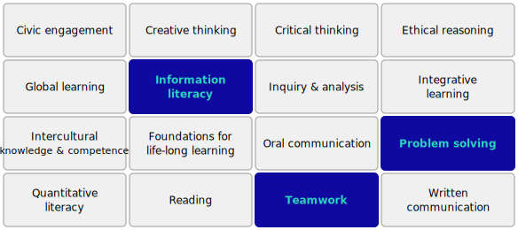
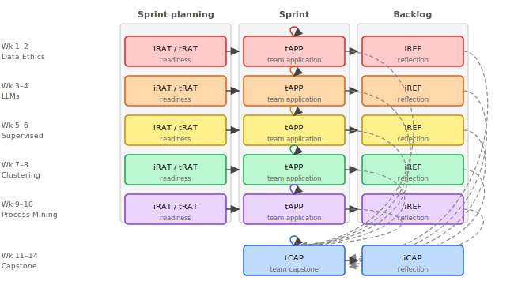



## Motivation

::: {.fa-card cols=1}
- building-columns | Academia | aims to prepare students for professional practice, but offers limited guidance on how to operationalize this in course design and assessment
- industry | Industry | expects credible, reproducible results supported by clear reasoning and usable for decision-making
- scale-balanced | **Underlying mismatch** | what counts as "good work" differs between academic and professional contexts
:::

::: {.notes}
This work starts from a familiar gap.

Universities aim to prepare students for professional practice —
but translating that into course design is not straightforward.

At the same time, industry expectations are quite concrete.
Work needs to be credible, reproducible, and usable.

And these perspectives do not always align.

So the question is not whether we value the same things —
but how those values are actually operationalized in courses.
:::

---

## What prompted the redesign

::: {.fa-card cols=1}
- industry | **Observed in an industry-facing course** | | * industry partners valued collaboration — but would not use the results | * students reported a very heavy and uneven workload
- circle-question | **Core question** | how do we design courses so that student work is \_authentic in practice\_, while still supporting \_meaningful learning\_?
:::

::: {.notes}
This is not just a theoretical issue.

In an earlier version of the course, we worked with an industry partner
and asked how useful the student results were.

They appreciated the collaboration —
but they would not actually use the results.

At the same time, students experienced the course as quite heavy
and time-consuming.

So the course was not fully working for either side.

That leads to the core question:
how do we design assessment so that the work is authentic in practice,
while still supporting meaningful learning?
:::

---

## Context: Business Intelligence

::: {.fa-card cols=1}
- magnifying-glass-chart | **Overview** | | * 6 ECTS course | * advanced undergraduate and early graduate students | * 10–15 students, two teams
- database | **What is BI?** | data-driven decision support | * data analysis | * systems integration | * communication to inform organizational decisions
- bullseye | **Goal** | strengthen industrial relevance and professional competence
:::

::: {.notes}
The context is a Business Intelligence course.

What matters here is that BI is not just about analysis —
it is about decision support.

So students are not only expected to produce correct analyses,
but also to communicate assumptions, limitations, and implications.

And importantly, this is done in collaboration with an industry partner,
so the work is evaluated in a realistic context.
:::

---

## Industry-engaged project

::: {.fa-card cols=1}
- handshake | **Sustained industrial context** | a single dataset and domain used across the entire semester
- industry | **Industry partner role** | | * problem framing | * milestone discussions | * final evaluation
- scale-balanced | **Dual context** | academic and industry perspectives coexist throughout
:::

::: {.notes}
An initial, relatively simple change addressed both concerns.

We moved to a single, persistent industry case across the semester.

This reduces workload by removing repeated onboarding and allows students to build
a deeper and more coherent understanding of the data and domain.

So instead of producing isolated analyses,
they develop work that evolves over time within a realistic setting.

This creates the conditions for more meaningful and usable results.
:::

---

## Design focus: LOUIS-guided

::: {.fa-card cols=1}
- key | **Design focus** | | * limited set of competences (LOUIS) | * sustained industry context | * iterative development toward capstone
:::

[[**LOUIS**](https://aurora-universities.eu/louis/) — Learning Outcomes in University for Impact on Society (Aurora University Network). Focus on a small set of competences (max 3).]{.lean-in}

{style="width:100%;max-height:420px;object-fit:contain;display:block;margin:auto"}

::: {.notes}
For this redesign, I attended a workshop on the LOUIS framework —
Learning Outcomes in University for Impact on Society.

LOUIS is part of the Aurora University Network,
and is intended to strengthen broader academic and personal competences
alongside subject knowledge.

A key takeaway from that workshop was to avoid spreading too thin —
instead, focus on a small number of competences
and make expectations explicit.

So this redesign is directly informed by that work.

LOUIS helped translate high-level competence goals
into concrete learning outcomes that students can understand and act on.
:::

---

## Pedagogical structure

{width=100% style="display:block;margin:auto;max-height:560px"}

```{=html}
<p style="text-align:center;margin-top:0.4em;font-size:14px;color:var(--muted);font-style:italic">
  <i class="fa-solid fa-user-plus"></i> <strong>Team-Based Learning:</strong>
  <i class="fa-solid fa-user"></i> iRAT (individual readiness) &nbsp;·&nbsp;
  <i class="fa-solid fa-users"></i> tRAT (team readiness) &nbsp;·&nbsp;
  <i class="fa-solid fa-users"></i> tAPP (team application) &nbsp;·&nbsp;
  <i class="fa-solid fa-user"></i> iREF (individual reflection)
</p>
<p style="text-align:center;margin-top:0.1em;font-size:14px;color:var(--muted);font-style:italic">
  <i class="fa-solid fa-shuffle"></i> <strong>Flipped classroom</strong> &nbsp;·&nbsp;
  <i class="fa-solid fa-repeat"></i> <strong>Iterative modules</strong> leading into capstone
</p>
```

::: {.notes}
The course combines TBL with iterative project work via PBL.

Students prepare individually before class,
and class time is used for discussion and guided project work.

iRAT = individual readiness assurance test
tRAT = team readiness assurance test
tAPP = team application
iREF = individual reflection

The capstone brings all prior work together —
students revisit and refine previous analyses
rather than starting fresh.
:::

---

## Assessment as development [_Core mechanism_]{.slide-subtitle}

::: {.fa-card cols=1}
- list-check | **One rubric, many iterations** | same assessment rubric reused across all modules and the capstone | * analytical soundness | * transparency | * reproducibility | * stakeholder relevance
- forward | **Developmental shift** | feedback is \_carried forward\_ — not reset between tasks
:::

[Standards fixed; performance expectations scaled during the learning phase.]{.lean-in}

::: {.notes}
A key mechanism is how expectations are made explicit.

From the beginning, students are shown the final rubric —
so they know what high-quality work looks like.

However, during the learning phase, assessment is scaled.

So instead of grading against the final standard,
work is normalized to what counts as "very good."

This signals clearly: this is what is expected for the final project.

It also helps students prioritize their effort —
they can identify what needs to be improved and revisit earlier work.

So the rubric is not just used for grading —
it becomes a tool for guiding development over time.
:::

---

## Accumulated feedback

::: {.fa-card cols=1}
- code-pull-request | **Pull Requests as assessment architecture** | changes are proposed, reviewed, discussed, and integrated — or explicitly deferred
- repeat | **Structured accumulation** | | * same rubric reused | * prior feedback revisited | * unresolved issues explicitly carried forward
- toolbox | **Enabled by tooling** | version control and persistent work traces via GitHub
:::

::: {.notes}
In practice, this is implemented through pull requests.

Each piece of work is proposed, reviewed, discussed, and then either accepted or deferred.

So instead of submitting assignments and moving on,
the work remains open and revisitable.

If an issue is raised and not resolved, it stays visible.

That means later work is evaluated in light of earlier feedback.

Students cannot simply move on — they have to revisit and improve.

Because the same rubric is reused,
I can also directly see what has changed —
and whether earlier issues have been addressed.

So assessment becomes more focused,
and grading is faster because I am not re-evaluating everything from scratch.
:::

---

## Evolving feedback

::: {.fa-card cols=3}
- chalkboard-user | **Instructor** | | * method | * implementation
- industry | **Industry partner** | | * domain relevance | * decision context
- user | **Student** | | * knowledge transfer through PRs | * defending decisions | * critiquing peer work
:::

::: {.fa-card cols=2}
- clock | **Progression over time** | | * align within teams | * cross-team review | * industry validation
- network-wired | **Audience shift** | from internal review to external scrutiny
:::

::: {.notes}
Who gives feedback:
- The instructor focuses on method and implementation.
- The industry partner focuses on relevance and decision context.
- And importantly, students themselves are a key part of the process.
  Through PRs, they engage in knowledge transfer —
  by defending their own work and critiquing others.

When does the feedback evolve:
- During the modules, the focus is on aligning within teams.
- In the capstone, this expands to cross-team review.
- And finally, the work is exposed to the industry partner.

What this means is the audience widens:
Feedback moves from internal to external and more critical scrutiny.
:::

---

## Credibility and trust

::: {.fa-card cols=1}
- shield | **Industry threshold** | credibility is fragile: early issues can undermine trust in the entire result
- clipboard-list | **What is evaluated** | | * reproducibility | * transparency | * clear assumptions
- lightbulb | **Shift in communication** | build trust first — then invite inspection
:::

::: {.notes}
As feedback moves from internal to external,
the consequences change.

In an earlier version of the course,
students presented their work in a standard academic way.

During one presentation, the industry partner identified
an issue early in the analysis.

Even though the rest of the work was reasonable,
that early issue reduced trust in the entire result.

So they did not engage further.

This is what we mean by credibility being fragile.

So we made a deliberate shift in how students communicate.

The goal is to build trust first,
so the audience is willing to engage more deeply.

Because the full history is available,
the work becomes traceable and reproducible.

So credibility is not just claimed — it can be inspected.
:::

---

## Team and individual accountability

::: {.fa-card cols=2}
- users | **Team-level** | | * analytical quality | * coherence | * relevance
- user-check | **Individual-level** | | * visible artifacts | * documented contributions | * structured reflection
:::

::: {.fa-card cols=1}
- compass-drafting | **Design goal** | accountability without fragmenting teamwork — designed into the course architecture, not added after the fact
:::

::: {.notes}
Another design challenge is balancing teamwork with individual accountability.

The goal is not to split the work into isolated individual tasks,
but to make individual contributions visible within the team context.

This is enabled through the workflow we've introduced.

Because all work is proposed, reviewed, and discussed,
you can see who contributed what,
how they engaged with feedback,
and how their work evolved over time.

So accountability comes from traceable contributions,
not from separating the work.
:::

---

## Indicative evidence

::: {.fa-card cols=1}
- user-graduate | **Students & graduates** | | * high engagement without attendance requirements | * transfer of reproducible workflows | * stronger documentation practices
- building-columns | **Academic perspective** | more ambitious, student-driven projects
- industry | **Industry perspective** | improved coherence and credibility; results could be implemented in practice
:::

::: {.notes}
There is no formal attendance requirement in this course.
However, compared to other courses I teach with the same student group,
attendance and participation are noticeably higher.

We also observe transfer.
Students adopt reproducible workflows and stronger documentation practices,
and continue to use them beyond the course.

From the industry perspective,
the outputs are more coherent and credible,
and importantly, they can see how the results
could be implemented in practice.

So while this is not controlled evidence,
the signal is consistent across students, graduates, and partners.
:::

---

## What students must learn to handle

::: {.fa-card cols=1}
- bolt | **What becomes visible** | the design makes certain challenges explicit | * giving and receiving critical feedback | * making work visible and reviewable | * managing workload in a structured workflow
:::

::: {.notes}
What becomes clear with this design
is not just improved outcomes —
but also the challenges students need to learn to handle.

Giving and receiving critical feedback:
Students are often hesitant to critique peers,
but this becomes a central part of the workflow.

Making work visible:
Everything is open to review —
which creates accountability,
but also requires students to articulate and justify their decisions.

Managing workload:
The structure introduces overhead,
and students feel that early on.

But that structure is also what enables
iteration, feedback, and improvement.

So the point is not to remove these challenges.
They are a direct consequence of making the work visible —
and part of what students need to learn to navigate.
:::

---

## What this design does

::: {.fa-card cols=1}
- compass-drafting | **Transferable principles** | for CDIO-aligned, industry-engaged courses | * sustained industry context — no repeated onboarding | * assessment drives iteration, not just evaluation | * contributions are visible and reviewable | * feedback accumulates across the course | * students adapt to different audiences | * tooling supports — but does not define — the design
:::

::: {.notes}
This can be summarized in a few key design choices.

A sustained industry context — so students build depth instead of repeatedly onboarding.

Assessment is used to drive iteration, not just to evaluate final outputs.

Contributions are made visible and reviewable,
which supports accountability without fragmenting teamwork.

Feedback accumulates across the course,
so students revisit and improve earlier work.

And finally, students learn to adapt their work
to different audiences — academic and industry.

The tooling supports this,
but the key contribution is the alignment
between learning and professional practice.
:::

---

## Limitations and future directions

::: {.fa-card cols=2}
- lock | **Current limitations** | | * depends on student readiness | * scalability considerations | * domain-specific transferability
- screwdriver-wrench | **Design refinements** | | * earlier preparation for professional tooling | * improved stakeholder interaction | * structured team-building to accelerate trust | * scaling across courses and partners
:::

::: {.notes}
This is a design-oriented case — not a controlled study.

It depends on student readiness,
and there is some initial overhead.

Early in the semester,
students often experience the workload as heavy.
But later they consistently describe this
as one of the most valuable parts of their studies.

So there is a clear shift
from short-term effort to long-term value.

Scaling needs to be considered carefully.
At the current size, it is manageable.

And one ongoing refinement
is strengthening the initial phase —
giving students more time
to build trust, understand the data, and align as a team
before introducing more advanced methods.
:::

---

## Questions?

::: {.two-col}
::: {.col}
{.contact-photo}
:::

::: {.col}
```{=html}

```
:::
:::

::: {.notes}
This brings us back to the original problem.

The issue was not student ability —
it was that the work was not credible or usable in context.

What this case shows
is that professional competence does not emerge by itself.

It requires making expectations explicit —
especially around credibility, trust, and use.

Assessment and feedback are the mechanisms that make this visible.

When feedback accumulates,
and when students must respond to different audiences,
they begin to align their work with real practice.

So the contribution is not a specific tool or method.

It is showing how assessment and feedback
can be used to align learning with professional expectations.
:::
